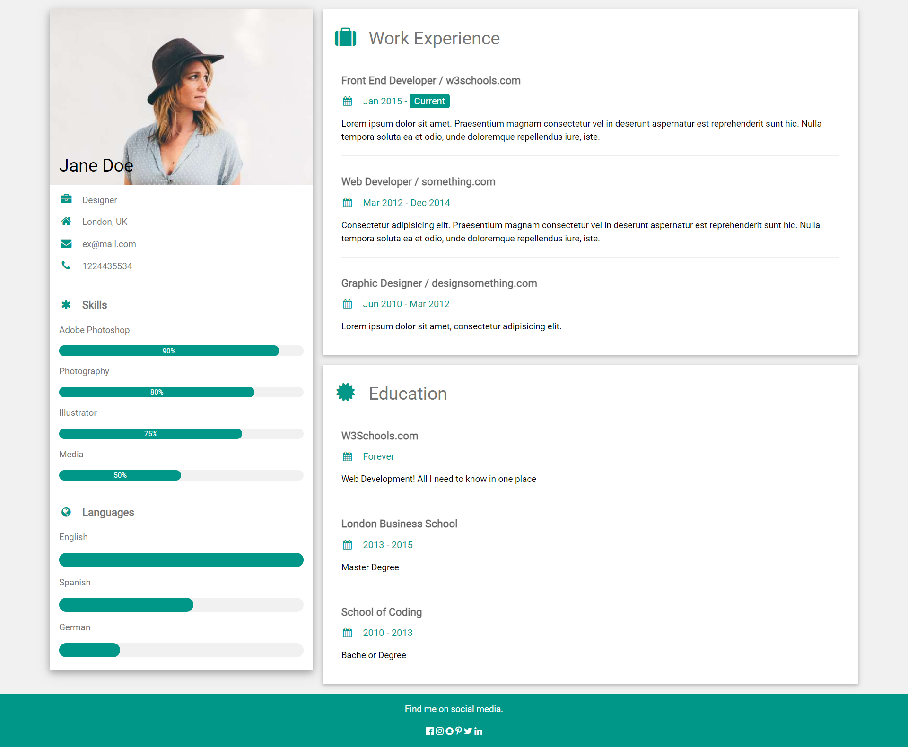
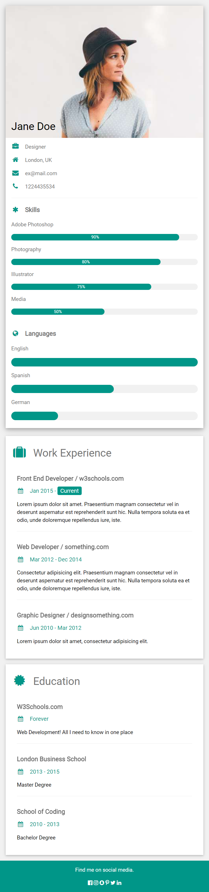

# **Resume website lab**

## **Overview**
In your careers as web developers you will need portfolios, which are showcases of your skills, abilities, and previous projects. Design this webpage and pin it on your github profile. When you're looking for a job this will help you out.

## **Design**
### Desktop

### Mobile

## **Information**
This is a web page that can be used to host your portfolio. If you think about making your own portfolio, then we encourage you to do your own thing in order to be unique. However, treat this as a source of inspiration and practice.

#### **What is the used color?**
The used color is `#009688`

#### **What is the used font?**
The used font is Roboto which can be found in the font page (you need to import it into your HTML and CSS thought)

#### **There are icons in there? How can I find them?**
Use Font awesome. If you don't know about it, you can find how to use it [here](https://www.w3schools.com/icons/fontawesome_icons_intro.asp). 

To learn more about font awesome, visit their [website](https://fontawesome.com/).

#### **Can I add my own flavor to this page?**
*Of course*, in fact we encourage you to do that. The color given above is if you don't know what color to use, but if you want to add your own touch to that then yes you can.

### **Instructions**
- Plan how you will work on this website. It doesn't have to be perfect, but you need to know exactly what you are going to do. Remember that you need to look at the overall layout of the page before you can go to the details.
- As you can see the page is responsive. Make sure that the design changes when it reaches 600px. That doesn't mean that you can't style it more using other media queries.

If you have issues, google them.
 
If you still have issues, talk to your friends in the same room.
 
If you still have issues, talk to your instructors.
 
 

Good luck and have fun :D 
